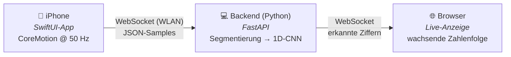

# ✍️ Air-Writing — Ziffernerkennung in der Luft


Ziffern **(0–9)** werden mit dem **iPhone** in die Luft geschrieben, per WLAN an
einen Laptop gestreamt, dort segmentiert und mit einem **1D-CNN** erkannt. Die
erkannten Ziffern erscheinen **live im Browser** als wachsende Zahlenfolge.

Die Erfassung läuft über eine **native iOS-App** (SwiftUI + CoreMotion).



---

## 📖 So funktioniert es

Ziffer schreiben → **kurze Pause** → nächste Ziffer → kurze Pause …

Jede Schreibbewegung zwischen zwei Pausen ist **genau eine Ziffer (0–9)**.
Mehrere nacheinander ergeben eine Zahlenfolge: `4` · Pause · `2` → **„42"**.

| Schritt | Modul | Was passiert |
|---|---|---|
| 1️⃣ Segmentierung | `backend/segmentation.py` | State-Machine (idle ↔ writing) trennt den Sensorstrom an den Pausen |
| 2️⃣ Vorverarbeitung | `backend/preprocessing.py` | Resampling auf 100 Zeitschritte × 6 Kanäle + Z-Score-Normalisierung |
| 3️⃣ Augmentation | `backend/augment.py` | Jitter, Skalierung, Time-Warping, 3D-Rotation (nur beim Training) |
| 4️⃣ Klassifikation | `backend/model.py` | Kleines 1D-CNN (CPU-tauglich), Softmax über 10 Klassen |
| 5️⃣ Confidence-Check | `backend/server.py` | Unter Schwelle: **?** statt falsch raten |

### ✋ Schreibhaltung (wichtig für niedrige Fehlerquote!)
- Auf eine **gedachte senkrechte Tafel vor dir** schreiben (nicht auf einen Tisch).
- Ungefähr **gleiche Größe** der Ziffern.
- **Gleiche Strichrichtung/-reihenfolge** wie beim normalen Schreiben.
- Zwischen den Ziffern **deutlich innehalten** (~0,5 s ruhig halten).

---

## 📱 Die iOS-App

Die native **iOS-App** (SwiftUI) liest die Bewegungssensoren des iPhones aus
(`userAcceleration` + `rotationRate`) und streamt jedes Sample als JSON per
WebSocket an das Backend. Code: [`app/AirWritingPhone/`](app/AirWritingPhone/).

**Bauen/Installieren** (einmalig, nur auf einem **Mac mit Xcode** möglich):
Siehe [`app/README.md`](app/README.md). Auf dem iPhone ist die App bereits
installiert. ⚠️ **Mit kostenlosem Account läuft sie ~7 Tage**, danach muss sie
auf einem Mac neu installiert werden.

---

## 🚀 Schnellstart (Windows-Laptop)

Das **gesamte Daten-Sammeln und Training läuft auf dem Laptop** — kein Mac nötig.

```powershell
git clone https://github.com/Matadorrr91/air-writing-recognition.git
cd air-writing-recognition
python -m venv .venv
.venv\Scripts\Activate.ps1
pip install -r requirements.txt
```

### Laptop-IP herausfinden (für die App)
```powershell
ipconfig
```
→ IPv4-Adresse des WLAN-Adapters, z. B. `192.168.178.50`.
iPhone **und** Laptop müssen im **selben WLAN** sein. Ggf. die **Windows-Firewall**
beim ersten Start für Python/Port 8000 freigeben.

### Workflow
| Schritt | Befehl | Zweck |
|---|---|---|
| 1. Daten sammeln | `python -m backend.collect --person efe --count 30 --shuffle` | Gelabelte Trainingssegmente aufnehmen |
| 2. Modell trainieren | `python -m backend.train` | 1D-CNN trainieren, Confusion-Matrix ausgeben |
| 3. Live erkennen | `python -m backend.server` + Browser auf <http://localhost:8000> | Echtzeit-Erkennung 🎉 |

> 💡 **Ohne trainiertes Modell** läuft der Server im **Sammel-/Debug-Modus**
> (nur Segmentierung, keine Erkennung). Sobald `backend/models/model.pt`
> existiert, wird live erkannt.

> ⚠️ `collect` und `server` belegen **beide Port 8000** — immer nur **eines**
> gleichzeitig laufen lassen.

### In der iPhone-App
IP des Laptops (aus `ipconfig`) + Port `8000` eintragen → **Start**. Beim ersten
Mal **Bewegungs-** und **lokale-Netzwerk**-Erlaubnis bestätigen.

---

## 🛠️ Daten sammeln — im Detail

```powershell
python -m backend.collect --person efe --count 30 --shuffle
```
1. In der iPhone-App **Stop → Start** (verbindet mit dem Sammel-Server).
2. Das Terminal zeigt z. B. `>>> Schreibe jetzt: [ 3 ] (1/300)`.
3. **Diese** Ziffer schreiben → kurze Pause → wird gespeichert → nächste.
4. So durch alle durch, dann **Strg+C**.

- `--count 30` = 30 Aufnahmen je Ziffer (300 gesamt). **Mehr = bessere Erkennung**
  (README-Empfehlung: 60–100 je Ziffer pro Person).
- **Alle 10 Ziffern** sammeln, sonst kann das Modell fehlende nicht erkennen.
- Mehrere Personen: einfach mit unterschiedlichem `--person` sammeln.

---

## 🖥️ Server & Modell — im Detail

### Server starten
```powershell
python -m backend.server
```
Erfolg sieht so aus:
```
INFO:     Uvicorn running on http://0.0.0.0:8000 (Press CTRL+C to quit)
```
- Lauscht auf `0.0.0.0:8000` → im ganzen WLAN erreichbar (Konstanten in
  `backend/config.py`: `HOST`, `PORT`).
- **Live-Anzeige im Browser:** <http://localhost:8000> (auf dem Server-Rechner)
  bzw. `http://<laptop-ip>:8000` von anderen Geräten.
- Endpunkte: `WS /ws/watch` (Sensordaten von der App),
  `WS /ws/display` (erkannte Ziffern an den Browser).

### Windows-Firewall freigeben
Beim ersten Start fragt Windows „Zugriff zulassen?" → **Privat** anhaken +
zulassen. Falls verpasst, in PowerShell **als Administrator**:
```powershell
netsh advfirewall firewall add rule name="AirWriting 8000" dir=in action=allow protocol=TCP localport=8000
```

### Wo wird das Training gespeichert?
`python -m backend.train` schreibt am Ende **automatisch** zwei Dateien:

| Datei | Inhalt |
|---|---|
| `backend/models/model.pt` | trainierte 1D-CNN-Gewichte |
| `backend/models/norm_stats.npz` | Normalisierungs-Statistiken (mean/std) |

Beim nächsten Start von `backend.server` werden **beide automatisch geladen** →
ab dann Live-Erkennung. Fehlen sie, läuft der Server im Sammel-/Debug-Modus
(nur Segmente, keine Ziffern). Die Pfade stehen in `backend/config.py`
(`MODEL_PATH`, `NORM_STATS_PATH`).

### Trainings-Optionen
```powershell
python -m backend.train                          # Standard: 80 Epochen, Early Stopping, Augmentation x5
python -m backend.train --epochs 60 --augment-factor 6
```
- Bei **einer Person** nutzt das Training automatisch einen zufälligen 80/20-Split
  (Meldung „Nur eine Person → zufälliger Split"). Mehrere Personen → Cross-Person-
  Hold-out (`--test-person <name>`).
- Ausgabe: pro Epoche `train_loss / val_loss / val_acc`, am Ende
  **Test-Accuracy + Confusion-Matrix** (Zeile = wahr, Spalte = vorhergesagt).

### Wichtig zum Datensammeln
- Gesammelte Segmente **sammeln sich an**: `collect` kann mehrmals (auch an
  verschiedenen Tagen) laufen — neue Aufnahmen werden **ergänzt**, nicht
  überschrieben (Dateiname `{person}_{label}_{laufnummer}.npz`).
- Ablauf-Schleife: **collect → train → server**. Nach erneutem Sammeln:
  **neu trainieren**, dann Server neu starten, damit das aktualisierte Modell geladen wird.

---

## 📦 Datenformat

**Sensor-Sample (App → Server, JSON pro Nachricht):**
```json
{"t": 12.34, "ax": 0.01, "ay": -0.2, "az": 0.05, "gx": 0.1, "gy": 0.0, "gz": -0.3}
```
| Feld | Bedeutung |
|---|---|
| `t` | Zeitstempel in Sekunden (monoton, Gerätezeit) |
| `ax, ay, az` | `userAcceleration` in g — Schwerkraft bereits entfernt |
| `gx, gy, gz` | `rotationRate` in rad/s |

**Gespeichertes Segment** (`backend/dataset/`): `.npz` mit Array `x` der Form
`(N, 6)` in Kanal-Reihenfolge `[ax, ay, az, gx, gy, gz]`, dazu `label` und
`person`. Dateiname: `{person}_{label}_{laufnummer}.npz`.

---

## 🗂️ Projektstruktur

```
.
├─ README.md              ← dieses Dokument
├─ CLAUDE.md              ← Briefing für Claude Code (Windows)
├─ requirements.txt
├─ backend/
│  ├─ config.py           # zentrale Konstanten (Abtastrate, Schwellen, Pfade)
│  ├─ server.py           # FastAPI: WS-Empfang + Frontend + Live-Inferenz
│  ├─ collect.py          # gelabeltes Sammeln der Trainingsdaten
│  ├─ segmentation.py     # Pausen-/Bewegungs-State-Machine
│  ├─ preprocessing.py    # Resampling + Z-Score-Normalisierung
│  ├─ augment.py          # Data Augmentation
│  ├─ model.py            # 1D-CNN (PyTorch)
│  ├─ train.py            # Training + Evaluation (Confusion-Matrix)
│  ├─ data.py             # Laden/Speichern der Segmente
│  ├─ dataset/            # gesammelte Segmente (.npz) — nicht eingecheckt
│  └─ models/             # model.pt + norm_stats.npz — nicht eingecheckt
├─ frontend/
│  ├─ index.html          # Live-Anzeige (dark, kein Framework)
│  └─ app.js              # WebSocket-Client mit Auto-Reconnect
├─ app/                   # Xcode-Projekt der iOS-App (auf dem Mac gebaut)
│  ├─ AirWritingPhone/    # iOS-App (SwiftUI + CoreMotion)
│  └─ AirWriting.xcodeproj
└─ tests/
   ├─ test_pipeline.py    # Kernlogik ohne Hardware
   └─ smoke_e2e.py        # End-to-End inkl. Training + Server
```

---

## ✅ Tests

Die komplette Python-Kette lässt sich **ohne Hardware** verifizieren:

| Test | Befehl | Prüft |
|---|---|---|
| Pipeline-Tests | `python -m tests.test_pipeline` | Segmentierung, Vorverarbeitung, Augmentation, Speichern/Laden |
| End-to-End-Smoke | `python tests\smoke_e2e.py` | Daten erzeugen → Training → Inferenz → FastAPI-Server |

---

## 🗺️ Status

- [x] Streaming-Skelett — App sendet Daten, Server empfängt
- [x] Segmentierung — Schreib-Segmente live erkennen
- [x] Vorverarbeitung + Augmentation
- [x] 1D-CNN — Modell, Training, Confusion-Matrix
- [x] Live-Inferenz im Backend integriert
- [x] Web-Frontend — Echtzeit-Anzeige der Zahlenfolge
- [x] **App auf echter Hardware** (iPhone) — Verbindung & Streaming bestätigt ✅
- [ ] **Echte Daten sammeln** — ~60–100 Beispiele pro Ziffer pro Person
- [ ] **Tuning** — Energie-Schwellen, Confidence-Schwelle, Fehleranalyse

---

## 🩺 Troubleshooting

| Problem | Lösung |
|---|---|
| App: „could not connect / Sendefehler" | Server läuft? Gleiche WLAN? Richtige Laptop-IP? Windows-Firewall für Port 8000 frei? |
| App verbindet nicht (lokales Netz) | iOS: *Einstellungen ▸ Datenschutz ▸ Lokales Netzwerk ▸ AirWriting* einschalten |
| Viele **?** im Frontend | Confidence zu niedrig → mehr Daten sammeln, konsistente Schreibhaltung |
| Ziffern werden verwechselt (z. B. 1↔7) | Confusion-Matrix ansehen, gezielt mehr Beispiele sammeln |
| Segmente werden nicht erkannt | Schwellen in `backend/config.py` kalibrieren (`ENERGY_START_THRESHOLD` etc.) |
| `Address already in use` (Port 8000) | `collect` **und** `server` laufen gleichzeitig — eines beenden |
